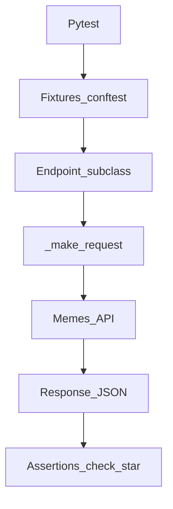

# Framework architecture

How the test code is structured and where to add a new endpoint or scenario.

**Language:** [Русский](../ru/architecture.md) · English

API contract: [`brd.md`](brd.md). Test expectations: [`qa-requirements.md`](qa-requirements.md).

---

## Data flow

```text
Pytest
  → fixtures (conftest.py)
  → Endpoint subclass (Authorize, CreateMeme, …)
  → Endpoint._make_request (+ Allure request/response)
  → HTTP → Memes API
  → response / json
  → check_* / assert
```



---

## Layers

| Layer | Path | Role |
|-------|------|------|
| Tests | `tests/` | scenarios, markers, parametrize |
| Fixtures | `conftest.py` | `auth_token`, clients, `meme_fixture`, `as_client` |
| API clients | `endpoints/` | one class ≈ one resource/method |
| Base | `endpoints/endpoint.py` | HTTP, Allure attach, shared asserts |
| Data | `utils/` | generators, positive/negative cases, `TypedDict` |
| Config | `endpoints/constants.py`, `.env` | URL, statuses, paths |

---

## Key classes

| Class | File | Purpose |
|-------|------|---------|
| `Endpoint` | `endpoints/endpoint.py` | `_make_request`, `_parse_response_json`, `check_status_*`, `check_successful_meme_response` |
| `Authorize` | `endpoints/authorize.py` | POST/GET authorize, kill, polling (tenacity) |
| `CreateMeme` | `endpoints/create_meme.py` | `POST /meme` |
| `GetAllMemes` | `endpoints/get_all_memes.py` | `GET /meme` |
| `GetMemeById` | `endpoints/get_meme_by_id.py` | `GET /meme/<id>` |
| `UpdateMeme` | `endpoints/update_meme.py` | `PUT /meme/<id>` |
| `DeleteMeme` | `endpoints/delete_meme.py` | `DELETE /meme/<id>` |

Inheritance: all clients → `Endpoint`.

TypedDict payloads: `utils/types.py` (`MemePayload`, `MemeUpdatePayload`).

Full fixture catalog (scope, when to use which): [`fixtures-reference.md`](fixtures-reference.md).

---

## Where to add a new endpoint

1. Class under `endpoints/` (subclass of `Endpoint`), method with `@allure.step`.
2. Path constant in `endpoints/constants.py` if needed.
3. Export in `endpoints/__init__.py` (when used from conftest).
4. Client fixture in `conftest.py` (or `as_client` for security).
5. Tests in `tests/test_*.py` + marker (`critical` / `medium` / `security`).
6. Update [`qa-requirements.md`](qa-requirements.md) / [`brd.md`](brd.md) if the contract changes.

## Where to add a new test

1. Pick a file by area (`test_memes_post.py`, …) or a new module.
2. Use fixtures (`meme_fixture`, `*_endpoint`); do not build HTTP by hand.
3. Assert via client `check_*` methods with clear messages.
4. For create without a fixture — `try`/`finally` or a cleanup fixture.

---

## Allure on requests

`_make_request` attaches to the step:

- `request` (method, url, headers with masked `Authorization`)
- `request_body` (when present)
- `response` / `response_body`

How to read failures: [`test-analysis.md`](test-analysis.md).
