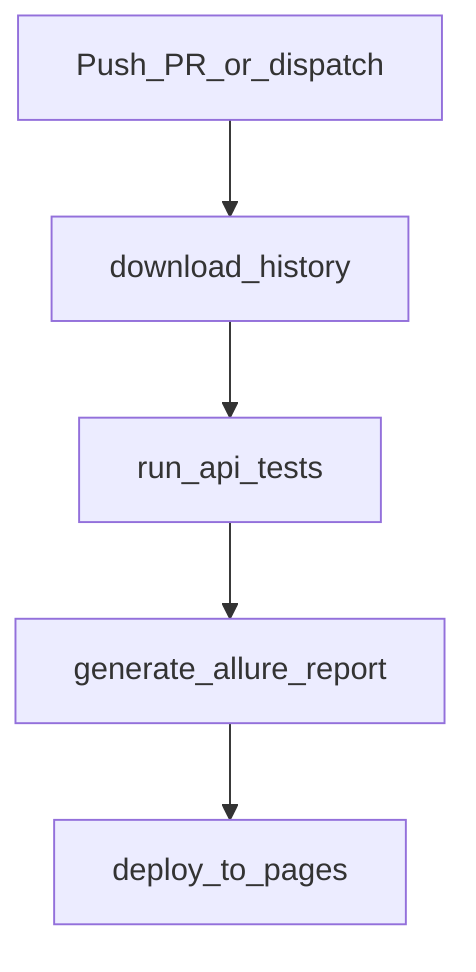

# CI/CD — GitHub Actions

Workflow: [`../../.github/workflows/api-tests.yml`](../../.github/workflows/api-tests.yml).

**Language:** [Русский](../ru/ci-cd.md) · English

Local run: [`local-run.md`](local-run.md). Reading failures: [`test-analysis.md`](test-analysis.md).

---

## When it runs

| Trigger | Behavior |
|---------|----------|
| `push` to `main` / `master` | full suite (`all`) |
| `pull_request` to `main` / `master` | full suite (`all`) |
| `workflow_dispatch` | manual run; suite: `all` / `critical` / `medium` / `security` |

Repository secrets: `BASE_URL`, `TEST_USERNAME`, `TEST_TOKEN` (same role as local `.env`).

---

## Pipeline



```text
download-history
        │
        ▼
  run-api-tests          ← mypy + pytest → allure-results
        │
        ▼
generate-allure-report   ← allure generate → _site + history
        │
        ▼
  deploy-to-pages        ← GitHub Pages
```

### Job 1: `download-history`

- Finds the previous completed run and downloads the `allure-history` artifact.
- Needed for Allure **Trends** across runs.
- Temporary artifact: `internal-history-transport`.

### Job 2: `run-api-tests`

1. Checkout, Python 3.12.
2. `pip install -r requirements.txt` and `requirements-dev.txt`.
3. **`mypy`** — type gate (a red mypy means the job is not truly green).
4. **`pytest`** with Secrets:
   - `all` → full suite;
   - otherwise → `pytest -m <suite>`.
5. Results in `allure-results`.
6. Because of `--clean-alluredir` in `pytest.ini`, history is copied **after** pytest into `allure-results/history/`.
7. Artifact `allure-results-raw` (7 days).

> The pytest step uses `continue-on-error: true`: the report is still built. Check the step status and Allure on Pages.

### Job 3: `generate-allure-report`

1. Downloads `allure-results-raw`.
2. Java + Allure CLI.
3. `allure generate … -o _site`.
4. Prepares `allure-history` for the next CI run.
5. Upload Pages artifact.

### Job 4: `deploy-to-pages`

- Publishes HTML to the **github-pages** environment.
- URL — in the deployment UI / Environments.

---

## Local vs CI

| | Local | GitHub Actions |
|--|-------|----------------|
| Secrets | `.env` | Repository Secrets |
| Machine | your PC | `ubuntu-latest` |
| Typecheck | `make lint` / pre-commit (optional) | **always** before pytest |
| Allure | `make allure` | generate + Pages |
| History/Trends | usually none | artifact between runs |
| Suite choice | `make critical`, etc. | push/PR = all; manual — dispatch |

Same principle: same tests and API. What changes is the environment and how the report is delivered.

---

## Short diagram

```text
push / PR / workflow_dispatch
  → download old Allure history
  → mypy
  → pytest (+ secrets) → allure-results (+ history)
  → allure generate → GitHub Pages
  → save new history for next run
```

Typical CI issues: [`troubleshooting.md`](troubleshooting.md).
