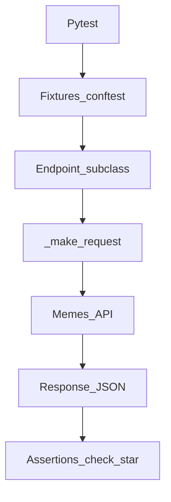

# Архитектура фреймворка

Как устроен код автотестов и куда добавлять новый эндпоинт или сценарий.

**Язык:** Русский · [English](../en/architecture.md)

Контракт API: [`brd.md`](brd.md). Ожидания тестов: [`qa-requirements.md`](qa-requirements.md).

---

## Поток данных

```text
Pytest
  → fixtures (conftest.py)
  → Endpoint subclass (Authorize, CreateMeme, …)
  → Endpoint._make_request (+ Allure request/response)
  → HTTP → Memes API
  → response / json
  → check_* / assert
```



---

## Слои

| Слой | Путь | Роль |
|------|------|------|
| Тесты | `tests/` | сценарии, маркеры, parametrize |
| Фикстуры | `conftest.py` | `auth_token`, клиенты, `meme_fixture`, `as_client` |
| API clients | `endpoints/` | один класс ≈ один ресурс/метод |
| База | `endpoints/endpoint.py` | HTTP, Allure attach, общие asserts |
| Данные | `utils/` | generators, positive/negative cases, `TypedDict` |
| Конфиг | `endpoints/constants.py`, `.env` | URL, статусы, пути |

---

## Ключевые классы

| Класс | Файл | Назначение |
|-------|------|------------|
| `Endpoint` | `endpoints/endpoint.py` | `_make_request`, `_parse_response_json`, `check_status_*`, `check_successful_meme_response` |
| `Authorize` | `endpoints/authorize.py` | POST/GET authorize, kill, polling (tenacity) |
| `CreateMeme` | `endpoints/create_meme.py` | `POST /meme` |
| `GetAllMemes` | `endpoints/get_all_memes.py` | `GET /meme` |
| `GetMemeById` | `endpoints/get_meme_by_id.py` | `GET /meme/<id>` |
| `UpdateMeme` | `endpoints/update_meme.py` | `PUT /meme/<id>` |
| `DeleteMeme` | `endpoints/delete_meme.py` | `DELETE /meme/<id>` |

Наследование: все клиенты → `Endpoint`.

TypedDict payload: `utils/types.py` (`MemePayload`, `MemeUpdatePayload`).

Справочник всех фикстур (scope, когда какую брать): [`fixtures-reference.md`](fixtures-reference.md).

---

## Куда добавить новый эндпоинт

1. Класс в `endpoints/` (наследник `Endpoint`), метод с `@allure.step`.
2. При необходимости константа пути в `endpoints/constants.py`.
3. Экспорт в `endpoints/__init__.py` (если нужен из conftest).
4. Фикстура клиента в `conftest.py` (или `as_client` для security).
5. Тесты в `tests/test_*.py` + маркер (`critical` / `medium` / `security`).
6. Обновить [`qa-requirements.md`](qa-requirements.md) / [`brd.md`](brd.md), если меняется контракт.

## Куда добавить новый тест

1. Выбрать файл по области (`test_memes_post.py`, …) или новый модуль.
2. Использовать фикстуры (`meme_fixture`, `*_endpoint`), не собирать HTTP вручную.
3. Проверки — через `check_*` на клиенте, с понятным сообщением.
4. Для create без фикстуры — `try`/`finally` или cleanup-фикстура.

---

## Allure в запросах

В `_make_request` к шагу прикрепляются:

- `request` (method, url, headers с маской `Authorization`)
- `request_body` (если есть)
- `response` / `response_body`

Как читать при падении: [`test-analysis.md`](test-analysis.md).
