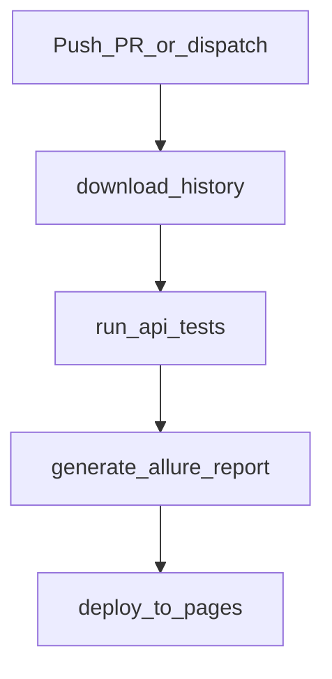

# CI/CD — GitHub Actions

Workflow: [`../../.github/workflows/api-tests.yml`](../../.github/workflows/api-tests.yml).

**Язык:** Русский · [English](../en/ci-cd.md)

Локальный запуск: [`local-run.md`](local-run.md). Разбор падений: [`test-analysis.md`](test-analysis.md).

---

## Когда запускается

| Триггер | Поведение |
|---------|-----------|
| `push` в `main` / `master` | полный прогон (`all`) |
| `pull_request` в `main` / `master` | полный прогон (`all`) |
| `workflow_dispatch` | ручной запуск; suite: `all` / `critical` / `medium` / `security` |

Секреты репозитория: `BASE_URL`, `TEST_USERNAME`, `TEST_TOKEN` (аналог локального `.env`).

---

## Пайплайн



```text
download-history
        │
        ▼
  run-api-tests          ← mypy + pytest → allure-results
        │
        ▼
generate-allure-report   ← allure generate → _site + history
        │
        ▼
  deploy-to-pages        ← GitHub Pages
```

### Job 1: `download-history`

- Ищет предыдущий completed run и скачивает артефакт `allure-history`.
- Нужен для **Trends** в Allure между прогонами.
- Временный artifact: `internal-history-transport`.

### Job 2: `run-api-tests`

1. Checkout, Python 3.12.
2. `pip install -r requirements.txt` и `requirements-dev.txt`.
3. **`mypy`** — gate по типам (падение останавливает «зелёный» смысл job, если mypy red).
4. **`pytest`** с Secrets:
   - `all` → весь suite;
   - иначе → `pytest -m <suite>`.
5. Результаты в `allure-results`.
6. Из‑за `--clean-alluredir` в `pytest.ini` history копируется **после** pytest в `allure-results/history/`.
7. Artifact `allure-results-raw` (7 дней).

> У шага pytest стоит `continue-on-error: true`: отчёт всё равно собирается. Смотрите статус step и Allure на Pages.

### Job 3: `generate-allure-report`

1. Скачивает `allure-results-raw`.
2. Java + Allure CLI.
3. `allure generate … -o _site`.
4. Готовит `allure-history` для следующего CI-прогона.
5. Upload Pages artifact.

### Job 4: `deploy-to-pages`

- Публикует HTML в environment **github-pages**.
- URL — в UI deployment / Environments.

---

## Local vs CI

| | Локально | GitHub Actions |
|--|----------|----------------|
| Секреты | `.env` | Repository Secrets |
| Машина | ваш ПК | `ubuntu-latest` |
| Типчек | `make lint` / pre-commit (по желанию) | **всегда** перед pytest |
| Allure | `make allure` | generate + Pages |
| History/Trends | обычно нет | артефакт между runs |
| Выбор suite | `make critical` и т.д. | push/PR = all; вручную — dispatch |

Принцип тот же: те же тесты и API. Меняется среда и доставка отчёта.

---

## Краткая схема

```text
push / PR / workflow_dispatch
  → download old Allure history
  → mypy
  → pytest (+ secrets) → allure-results (+ history)
  → allure generate → GitHub Pages
  → save new history for next run
```

Типичные проблемы CI: [`troubleshooting.md`](troubleshooting.md).
